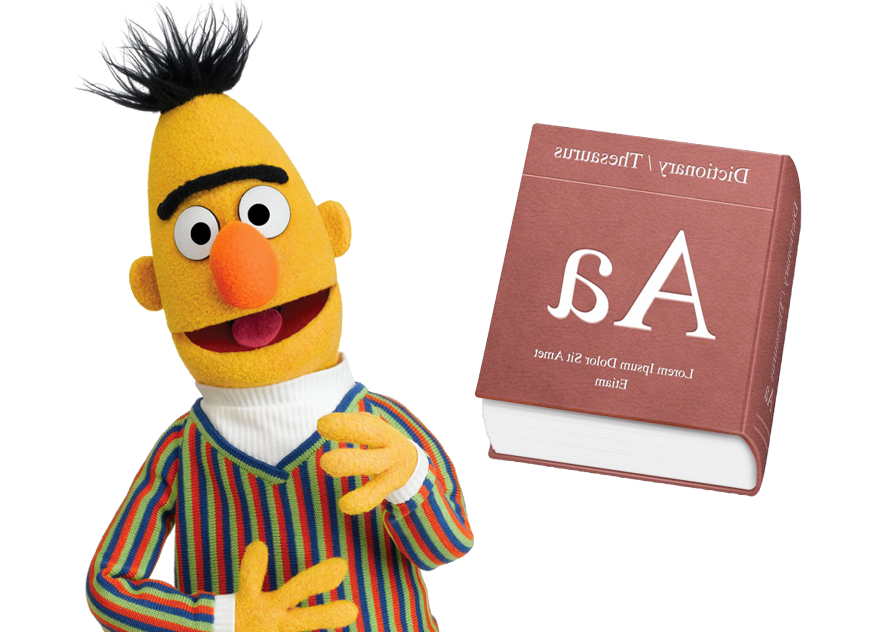

# Evaluating BERT Approaches for Reverse Dictionaries

    

### The Reverse Dictionary

Reverse dictionaries aim to solve a very common problem: given the definition or description of a word, can we accurately find that word? Reverse dictionary has a wide range of applications from helping writers better express themselves to aiding in second language acquisition. The past few years have witnessed great interest in reverse dictionaries, with approaches ranging from database-driven models to recurrent neural networks. 

We have tried several BERT-based methods to tackle this problem.

### Code

* `bert_baseline.py`: Implements a BERT model that maps definitions to the word2vec representations of the words they define
* `bert_masking.py`: Implements the masked BERT model (the baseline outlined in BERT for Monolingual and Cross-Lingual Reverse Dictionary).
* `bert_mask_multilabel.py`: Implements the multilabel masked BERT model.
* `sentencebert.py`: Implements the SentenceBERT model described in our paper.
* `character_bert.py`: Implements the CharacterBERT model described in our paper.

To train one of these models, use `python <filename>`. For example, to train the masked BERT model, run `python code/bert_masking.py`. 
